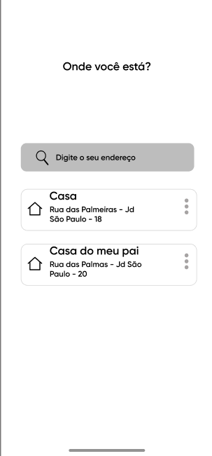
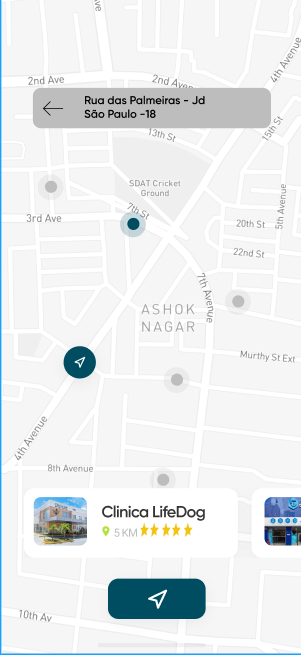
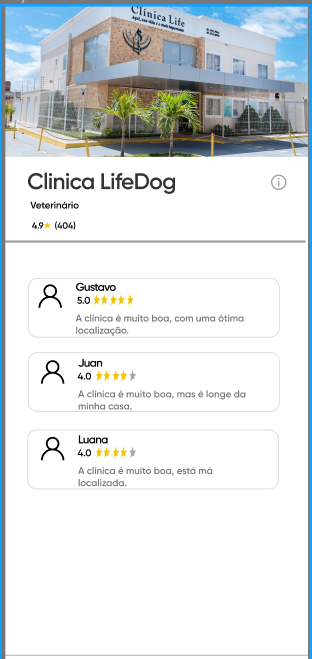

# Vets-Front

Foi criado a tela de login, usando HTML, CSS e  o framework Bootstrap
Participantes: João e Deise.

## Protótipo das telas

### Checklist

- Endereço
- [x] Desenho da tela
- [ ] Capturar o endereço inserido (latitude e longitude)
- [ ] Vincular com a tela Maps levando o endereço do usuário
- [ ] Ajustar Formatação

- Maps
- [x] Desenho da tela
- [ ] Retornar as clínicas no mapa
- [ ] Capturar a localização do Usuário
- [ ] Ajustar Formatação

- Detalhes
- [ ] Desenho da tela
- [ ] Vincular com Backend para retornar detalhes da Clínica
- [ ] Ajustar Formatação

## Tecnologias usadas

- HTML,CSS, JavaScript
- Api GoogleMaps
